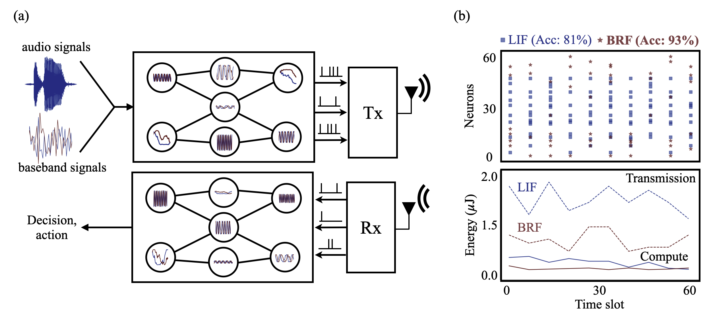

# NeuroComm-RF

## Neuromorphic Wireless Split Computing with Resonate-and-Fire Neurons
<p align="center">

</p>

This repository implements Neuromorphic Wireless Split Computing with Resonate-and-Fire Neurons. The code is modfied from [SNNCutoff](https://github.com/Dengyu-Wu/snncutoff) and [neurocomm-msnn](https://github.com/kclip/neurocomm-msnn).

---


## Getting Started

1. Install PyTorch and other dependencies:
   ```sh
   pip install -r requirements.txt
   ```

---
## Dataset Preprocessing: SHD

1. Download SHD dataset:
   ```sh
   python snncutoff/preprocessing/SHD.py
   ```
---


## Training

### Noiseless Training
Run the following script for noiseless training:
```sh
python training.py --config examples/shd_fc.yaml
```
### Wireless Evaluation
Run the following script for noiseless training:
```sh
python evaluation.py --config outputs/20250520_161607_819d5a0c86344666acec95d20eb43463/.configs/config.yaml
```
Note:  you have to update the path of model in the .configs/config.yaml.

evaluation:
  model_path: path_to_your_model

---

<!-- Citation -->
## Citation
For more details, please refer to the <a href="https://arxiv.org/abs/2506.20015">paper</a>.

```
@article{wu2025neuromorphic,
  title={Neuromorphic Wireless Split Computing with Resonate-and-Fire Neurons},
  author={Wu, Dengyu and Chen, Jiechen and Poor, H Vincent and Rajendran, Bipin and Simeone, Osvaldo},
  journal={arXiv preprint arXiv:2506.20015},
  year={2025}
}
```

